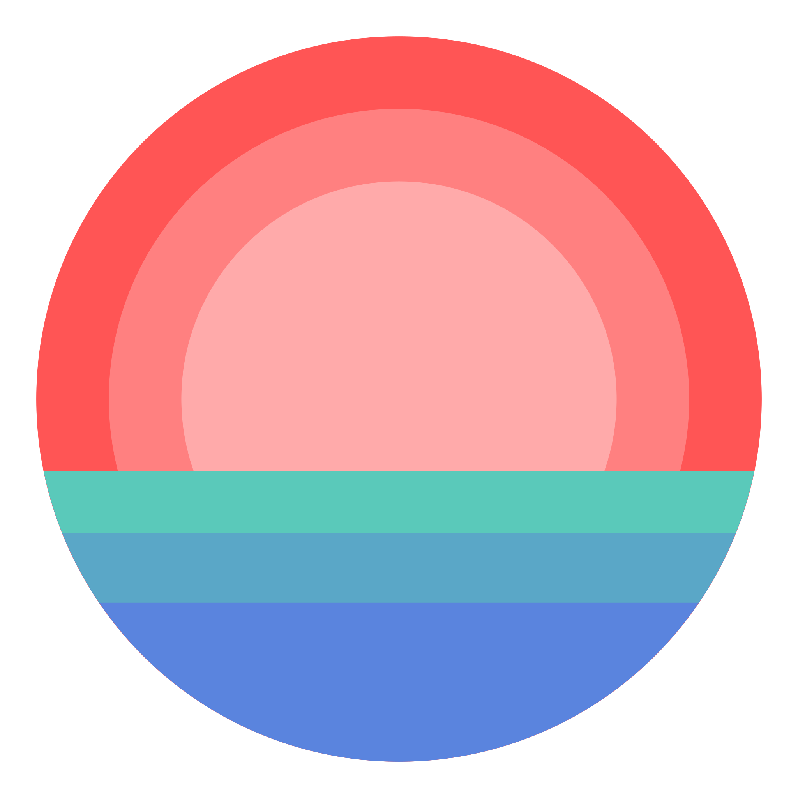

<div align="center">
    
</div>

# Seascape
seascape is a client library for the [Jellyfin](https://jellyfin.org) server API. This library was inspired by multiple other wrappers, especially [rspotify](https://github.com/ramsayleung/rspotify). It is still a pre-release work-in-progress, and does not yet implement the vast amount of calls that Jellyfin's API currently offers, but you can find the complete Jellyfin API reference [here](https://api.jellyfin.org). This library is compatible with version 10.7.5 of the server.

## Quickstart Guide

All calls to the Jellyfin API are performed using an instance of the `client::Jellyfin` struct. It is recommended to use the `client::Builder` to build this. Although there are some public methods available that don't require any authentication, almost all usage requires authentication via either API key or user-based authentication. This library only supports asynchronous operations.

### Example

```
let jellyfin = client::Builder::new("https://jellyfin.mydomain.com")
    .username("MyUsername")
    .password("MyPassword")
    .client("MyApp")
    .device("MyDevice")
    .device_id("xxx")
    .version("0.1.0")
    .build()
    .await
    .unwrap();

let artist = jellyfin.artist("Iron Maiden", None).await.unwrap();
println!("Album count is {}.", artist.album_count.unwrap());
```